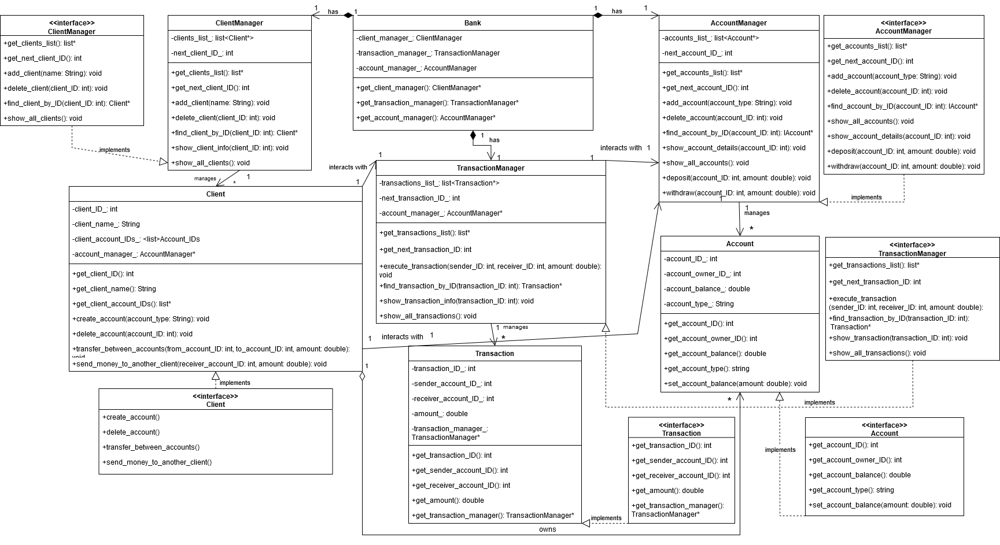

# Refactoring - Bank System

## Overview
**Refactoring** is a banking system project that has been transformed from a procedural programming approach to an object-oriented design as practical exercise for "Object-Oriented Programming" subject in SPbPU. This project efficiently manages clients, accounts, and transactions while providing a user-friendly command-line interface.

## UML-diagram of project


## Features
- **Client Management**: Register, delete, and view clients.
- **Account Management**: Create, delete, and view account details.
- **Transactions**: Perform deposits, withdrawals, and transfers between accounts.
- **Logging & Testing**: Integrated unit tests ensure system stability.

## Project Structure
```
├── BankApp
│   ├── Account.h / Account.cpp              # Account class
│   ├── AccountManager.h / AccountManager.cpp # Account Manager
│   ├── Client.h / Client.cpp                # Client class
│   ├── ClientManager.h / ClientManager.cpp  # Client Manager
│   ├── Transaction.h / Transaction.cpp      # Transaction class
│   ├── TransactionManager.h / TransactionManager.cpp # Transaction Manager
│   ├── Bank.h / Bank.cpp                    # Main Bank System
│   ├── Interfaces                           # Abstract interfaces for managers
│   ├── main.cpp                             # Main entry point
├── tests                                 # Unit tests
```

## Installation & Usage
1. Clone the repository:
   ```bash
   git clone ...
   cd Refactoring
   ```
2. Compile the project:
   ```bash
   g++ -o bank_system src/*.cpp -I include
   ```
3. Run the application:
   ```bash
   ./bank_system
   ```

## Testing
Unit tests are implemented for all core functionalities:
```bash
./run_tests
```

## Design Principles
- **Encapsulation**: Each class is responsible for its own data and behavior.
- **Modularity**: Independent components for better maintainability.
- **Scalability**: Easy to extend with new features.

## Future Enhancements
- Implement a database backend for persistent data storage.
- Develop a graphical user interface.
- Add security features such as authentication and authorization.

## Contributors
- **Ivan Latin** - Developer

## License
This project is copyright free for educational purposes

